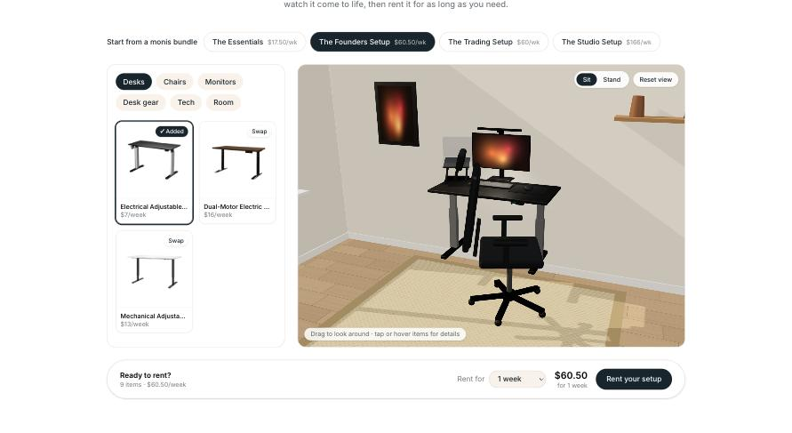

# Design Your Workspace — monis.rent

Interactive workspace builder for [monis.rent](https://www.monis.rent): pick a desk, a chair, and gear from their real catalogue, watch it drop into a 3D room, then rent the setup.

**Live:** https://desent-coding-test-2-beryl.vercel.app



## What you can do

- Choose from 36 real monis.rent products (names, photos, and prices snapshotted from their catalogue), across desks, chairs, monitors, desk gear, tech, and room items.
- See each item appear in a sunlit 3D room: drag to look around, hover or tap any item for its name and price, and click it to jump to its card.
- Switch the desk between sitting and standing.
- Start from one of monis.rent's bundles (Essentials, Founders, Trading, Studio).
- Pick a rental length; from 1 month, monis.rent's long-term weekly rates apply.
- Check out with a per-item summary that links to each product on monis.rent.

## Development

```bash
pnpm install
pnpm dev
```

- `pnpm lint` — Biome check
- `pnpm test` — selection and pricing rules (Node's built-in test runner)
- `pnpm build` — production build

Product data lives in `src/data/products.ts` and `src/data/bundles.ts`; the selection and pricing rules are in `src/lib/selection.ts`; the 3D scene is in `src/components/workspace-builder/scene/`.
